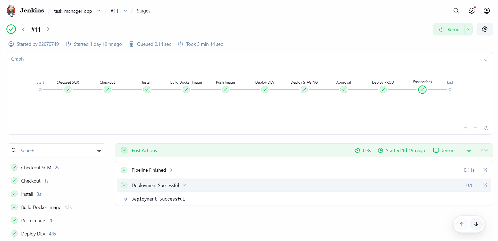
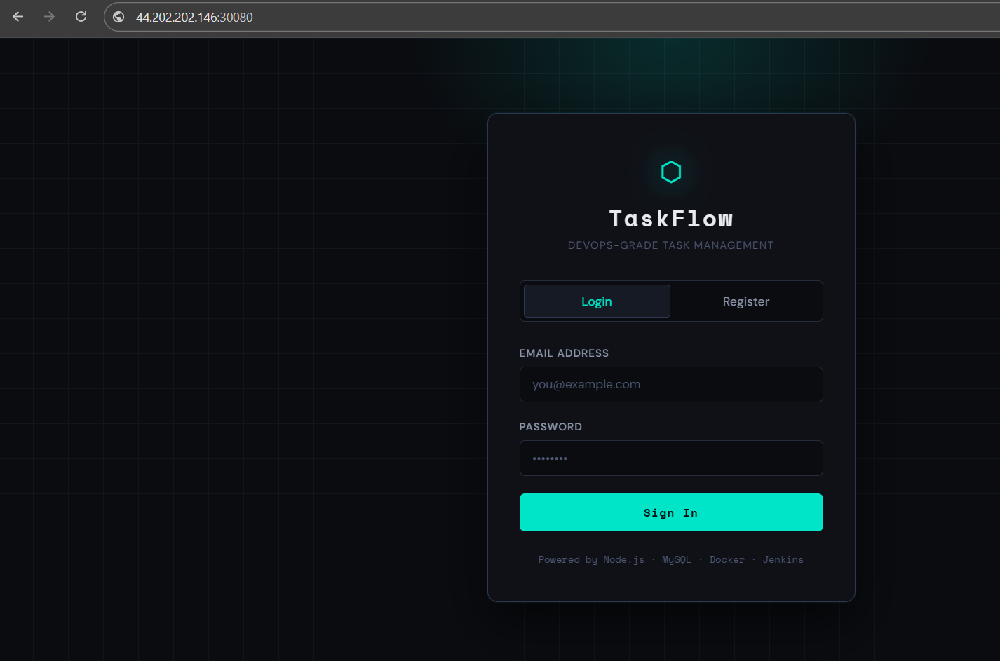
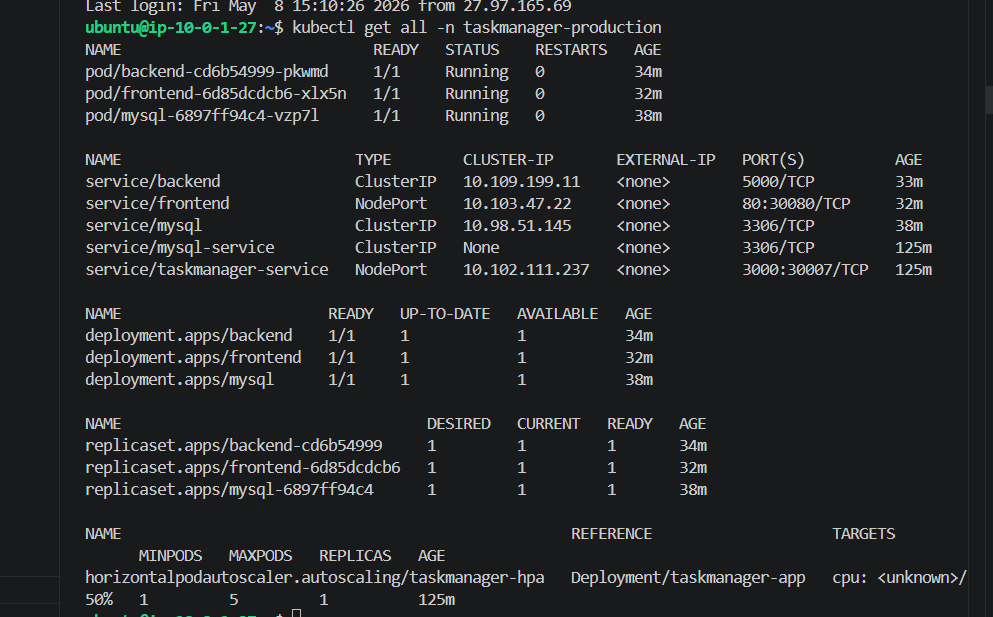
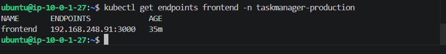

# 🧠 TaskFlow — Production-Style DevOps CI/CD Pipeline on Kubernetes

TaskFlow is a production-oriented DevOps project that demonstrates how modern cloud-native applications can be containerized, automatically deployed, and managed using Docker, Jenkins, Kubernetes, and AWS EC2. The platform implements a complete CI/CD workflow where code pushed to GitHub automatically triggers Jenkins pipelines to build Docker images, push them to DockerHub, and deploy updated application versions to Kubernetes.

The infrastructure includes Kubernetes Deployments, Services, ConfigMaps, Secrets, Persistent Storage, Health Probes, and Horizontal Pod Autoscaling (HPA) to simulate production-style deployment practices. The system was designed with scalability, automation, reliability, and cost optimization in mind using a self-managed Kubernetes cluster on AWS EC2.

The project also demonstrates practical DevOps troubleshooting scenarios including Kubernetes networking issues, NodePort accessibility problems, service-to-pod communication debugging, Jenkins pipeline failures, and cloud security configuration management, reflecting real-world DevOps operational workflows.

---

# 📌 Project Overview

TaskFlow is a production-oriented DevOps project designed to demonstrate a complete CI/CD workflow for a containerized full-stack application.

The project includes:

- Full-stack task management application
- Docker containerization
- Jenkins CI/CD automation
- Kubernetes orchestration
- AWS EC2 deployment
- Horizontal Pod Autoscaling (HPA)
- Kubernetes Secrets & ConfigMaps
- Persistent MySQL storage
- Rolling update deployment strategy
- Real-world troubleshooting and debugging

The application was deployed on a self-managed Kubernetes cluster running on AWS EC2 using a cost-optimized architecture.

---

# 🏗️ Architecture

```text
Developer Pushes Code
        │
        ▼
 GitHub Repository
        │
        ▼
 Jenkins Pipeline
        │
 ┌──────┴──────┐
 │ Build Image │
 │ Push Image  │
 └──────┬──────┘
        ▼
 DockerHub Registry
        │
        ▼
 Kubernetes Cluster (AWS EC2)
        │
 ┌──────┼──────────────┐
 │      │              │
 ▼      ▼              ▼
Frontend Backend     MySQL
 Pod      Pod         Pod
        │
        ▼
 NodePort Service (30080)
        │
        ▼
 Public Access via EC2 Public IP
```

---

# ⚙️ Tech Stack

| Technology | Purpose |
|---|---|
| Node.js + Express.js | Backend |
| HTML/CSS/JavaScript | Frontend |
| MySQL 8 | Database |
| Docker | Containerization |
| Jenkins | CI/CD Automation |
| Kubernetes | Container Orchestration |
| AWS EC2 | Cloud Infrastructure |
| Docker Hub | Container Registry |
| Linux | Server Administration |

---

# ✨ Features

## ✅ DevOps Features
- Jenkins Pipeline Automation
- Docker Image Build & Push
- Kubernetes Deployment Automation
- Rolling Update Strategy
- Horizontal Pod Autoscaler (HPA)
- Kubernetes Health Checks
- Namespace Isolation
- ConfigMaps & Secrets
- Persistent Volume Claim (PVC)

## ✅ Cloud Features
- AWS EC2 Deployment
- NodePort Public Access
- Security Group Configuration
- Cost-Optimized Infrastructure

---

# 🔄 CI/CD Pipeline Workflow

```text
GitHub Push
     │
     ▼
Jenkins Pipeline
     │
     ▼
Docker Build
     │
     ▼
Docker Push → DockerHub
     │
     ▼
Kubernetes Deployment
     │
     ▼
Application Available on AWS EC2
```

---

# ☸️ Kubernetes Configuration

## Production Namespace
```yaml
namespace: taskmanager-production
```

## Kubernetes Resources Used
- Deployments
- Services
- Secrets
- ConfigMaps
- PersistentVolumeClaims
- HorizontalPodAutoscaler

---

# ⚡ Horizontal Pod Autoscaler (HPA)

```yaml
minReplicas: 1
maxReplicas: 5
averageUtilization: 50%
```

---

# ☁️ AWS Deployment

| Resource | Details |
|---|---|
| Cloud Provider | AWS |
| Service | EC2 |
| Instance Type | t3.micro |
| Kubernetes Type | Self-Managed Cluster |
| Access Method | NodePort |
| Public Port | 30080 |

---

# 🌐 Application Access

```text
http://EC2_PUBLIC_IP:30080
```

---

# 📸 Proof of Deployments

> ⚠️ AWS EC2 is destroyed after testing to avoid unnecessary AWS billing.
> The screenshots below were captured from the live running infrastructure.

| Feature | Screenshot |
|---|---|
| ✅ Jenkins Pipeline Success |  |
| ✅ Application Running on EC2 |  |
| ✅ Kubernetes Pods Running |  |
| ✅ Endpoints |  |


---

# 🛠️ Troubleshooting Challenges Solved

## 🔹 Kubernetes NodePort Not Accessible
- Diagnosed AWS Security Group issue
- Opened NodePort traffic on port `30080`

## 🔹 Kubernetes Service TargetPort Mismatch
- Fixed incorrect `targetPort`
- Corrected frontend service mapping from port `80` to `3000`

## 🔹 Jenkins GitHub Authentication Failure
- Resolved GitHub access and repository authentication issues

---

# 💰 Cost Optimization Strategy

To minimize AWS cloud cost:

- Used self-managed Kubernetes instead of Amazon EKS
- Used NodePort instead of LoadBalancer
- Used a single EC2 instance architecture
- Optimized for `t3.micro`

The AWS EC2 instance used during deployment/testing has been terminated to avoid unnecessary billing.

---

# 🚀 Future Improvements

- Kubernetes Ingress Controller
- HTTPS/TLS Integration
- Prometheus & Grafana Monitoring
- Helm Charts
- Terraform Infrastructure as Code
- GitOps with ArgoCD

---

# 👨‍💻 Author

## Ashish Kangale

DevOps Engineer | Cloud & Infrastructure Automation Enthusiast

Interested in building production-style DevOps CI/CD pipelines, Kubernetes-based cloud-native applications, automated deployment workflows, and scalable infrastructure solutions using Docker, Jenkins, Kubernetes, AWS, Linux, and modern DevOps practices.


---


